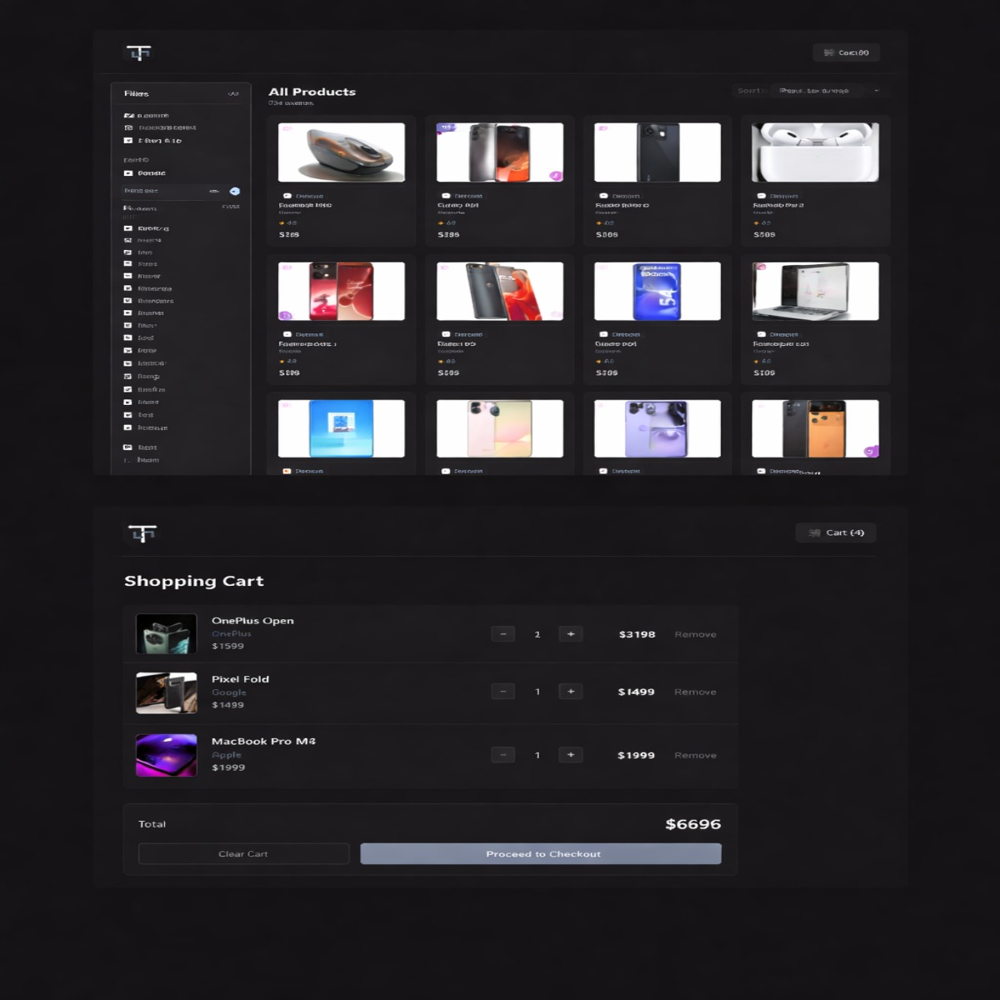

<div align="center">
  
  <h1>TechStore</h1>
  <p><strong>A Sleek, Interactive E-Commerce UI for Tech Enthusiasts</strong></p>

  <p>
    
    
    
  </p>
</div>

---

## 🎯 The Problem This Solves

Modern e-commerce sites often suffer from **"Filter Friction"** and **"Context Loss."** Users frequently struggle to find specific technical products within large catalogs or lose track of their selections when navigated away from the main view.

**TechStore** provides a seamless, "single-page-feel" solution where advanced filtering, product comparison, and cart management coexist without jarring page reloads or complex UI hurdles.

---

## ✨ Features Built

- **Interactive Product Grid**: A responsive layout handling 50+ unique tech products with real-time feedback.
- **Advanced Multi-Filter Panel**: Category, brand, price range, technical specs (RAM/Storage), stock availability, and customer ratings.
- **Side-by-Side Comparison**: A modal-based comparison engine that contrasts deep technical specs between any two products.
- **Persistent Shopping Cart**: A full-featured cart with quantity controls and real-time total calculations.
- **Modern Dark UI**: A premium, "developer-first" aesthetic focused on high readability and low eye strain.

---

## 🧠 Logic Handled

The core of this project isn't just the UI; it's the complex state management behind it:

- **Universal Multi-Filter Logic (AND Logic)**: Implementing a filtration engine that allows multiple active filters to intersect. A product only shows if it meets *all* selected criteria (e.g., Apple + 16GB RAM + In Stock + Under $1200).
- **Global Selection Constraints**: Logic to strictly limit product comparison to exactly two items, providing clear UI feedback (disabling other checkboxes) when the limit is reached.
- **State Persistence**: Syncing the entire filter state and cart contents with `localStorage`. This ensures that a page refresh doesn't wipe out a user's progress or their carefully selected filters.
- **Dynamic Sorting Engine**: Implementing custom sorting algorithms for Price (Low/High) and Ratings that work *on top* of the filtered results.

---

## 🛠 Tech Stack

- **Framework**: React 18 (Hooks: `useState`, `useMemo`, `useEffect`, `useContext`)
- **Routing**: React Router 6
- **Styling**: Vanilla CSS3 (Custom BEM Architecture & CSS Variables)
- **State Management**: React Context API
- **Build Tool**: Vite

---

## 🧱 Key Challenges

### 1. The "Filter Intersection" Problem
The biggest challenge was ensuring that the filter panel didn't become buggy as more filters were added. Handling the logic so that "Phones" could be filtered by "8 GB RAM" while simultaneously excluding "Out of Stock" items required a highly optimized `useMemo` filter chain to maintain performance.

### 2. UI Consistency without Libraries
Building a complex comparison table and a custom-styled range slider from scratch using only Vanilla CSS was challenging. It required meticulous attention to CSS Variables and the BEM naming convention to ensure the code remained maintainable and the dark theme felt cohesive across different components.

### 3. State Syncing
Managing two separate global contexts (Cart and Compare) while ensuring the URL-based category filtering (passed via search params) didn't conflict with locally stored filters required careful coordination of React's lifecycle methods.

---

## 🔧 Installation & Setup

1. **Clone & Install**
   ```bash
   git clone https://github.com/your-username/techstore.git
   cd techstore
   npm install
   ```

2. **Launch**
   ```bash
   npm run dev
   ```

---

<div align="center">
  <p>Built as a demonstration of high-level React logic and clean UI design.</p>
</div>